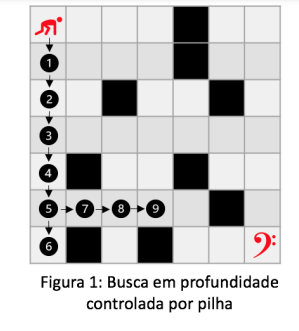
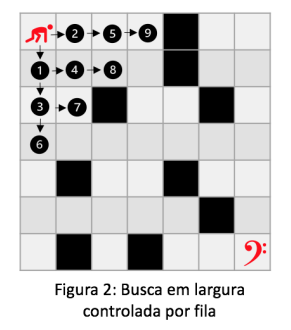
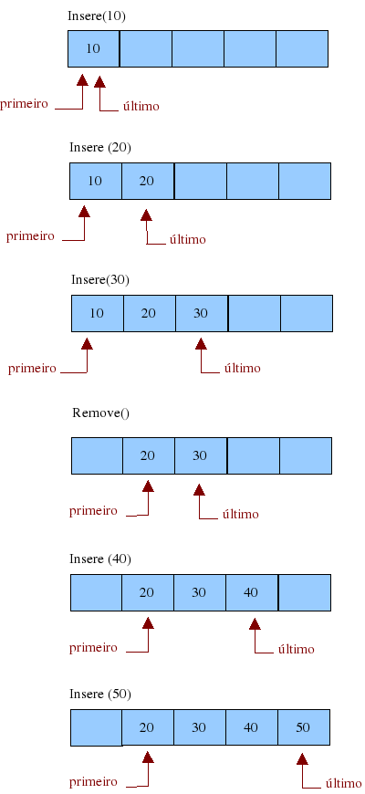
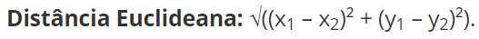
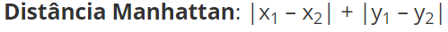

<h1># Métodos DFS, BFS, Euclidiano e Manhattan</h1>

 

 
</a> 

 

<h1>DFS</h1>

O DFS ou Busca em Profundidade é um algoritmo que percorre uma matriz nxn, desde o ponto inicial (0,0) até o ponto final (n,n), aprofundando totalmente em uma linha ou coluna, até que se chegue em uma barreira. Caso o algoritmo bata em alguma posição inválida ele tenta retornar uma posição e seguir outro caminho em profundidade por uma linha ou coluna, até que se encontre a posição final do labirinto.

 

	 

    Observando a figura acima, conseguimos observar o funcionamento do DFS, visto que ele inicia percorrendo a primeira coluna e quando bate na borda volta para tentar seguir caminho pela penultima linha.

    Esse algritmo usará da estrutura de pilha dinâmica para percorrer o labirinto. Essa que por sua vez funciona com um ponteiro apontando para o topo e outro para o fundo da estrutura, e os dados vão sendo empilhados na pilha.
    

    

    É possível observar o funcionamento da pilha pela imagem a seguir:
    

    

         
    

     

<h1>BFS</h1>

    O BFS ou Busca em largura é um algoritmo que percorre uma matriz nxn, desde o ponto inicial (0,0) até o ponto final (n,n), passando no máximo uma vez em cada posição, com a finalidade de percorrer o labirinto;

 
    

     

    Observando a figura acima, é visível que a matriz será percorrida por meio de fila, onde serão testadas todas as posições até o algoritmo conseguir alcançar a última posição.

    

    Com relação a estruturas da fila, será dinâmica. Isto significa que há um ponteiro apontando para o ínicio e outro apontando para o fim da estrutura, e entre eles são passados os dados.

    

    É possível observar o funcionamento da fila pela imagem a seguir:

    

     

 

<h1>Euclidiano</h1>

    Distância Euclidiana é definida como a soma da raiz quadrada da diferença entre x e y em suas respectivas dimensões.

    

 

    A figura acima mostra a equação Euclidiana. Essa que por sua vez será utilizada no algoritmo para verificar a distância até o fim da matriz.

 

<h1>Manhattan</h1>

    Distância Manhattan tem uma definição mais simples na qual é apenas a soma das diferenças entre x e y em cada dimensão. 

    

 

    A figura acima mostra a equação Manhattan. Essa que por sua vez será utilizada no algoritmo para verificar a distância até o fim da matriz.

    Explicado o básico das estruturas vamos ao funcionamento do código.

 

<h1># Algoritmo</h1>
    

    

    O algoritmo usa de uma matriz onde:
        <ul>
            <li>Posição válida = 0;</li>
            <li>Posição inválida = #;</li>
        </ul>
    Usando a estrutura de pilha, ele percorre o labirinto, iniciando no ponto (0,0), de forma que percorra um caminho em profundidade em uma linha ou coluna até que chegue em uma barreira. Após chegar em uma posição inválida ele retorna uma posição e tenta caminhar direto em outra linha ou coluna, em direção ao fim do labirinto. As posições são armazenadas gerando uma única pilha e retornando a quantidade de posições que foram necessárias para percorrer o labirinto.

    No menu inserido no main, será possivel fazer a seleção entre as 2 formas de percorrer o labirinto (BFS e DFS), caso a escolha seja pela primeira opção, o usuário poderá definir a forma de calcular a distância até o fim do método percorre (Euclidiana e Manhattan). Todos os métodos podem ser testados e comparados para teste.

 

<h1># Compilação e Execução</h1>
    

     
    
    O algoritmo disponibilizado possui um arquivo Makefile que realiza todo o procedimento de compilação e execução. Para tanto, temos as seguintes diretrizes de execução:
 
     
    <body>
        <table border="1px" align="center">
            <tr >
                <td align="center"><h3>Comando</h3></td>
                <td align="center"><h3>Função</h3></td>
            </tr>
            <tr>
                <td>make clean</td>
                <td>Apaga a última compilação realizada contida na pasta build</td>
            </tr>
            <tr>
                <td>make</td>
                <td>Executa a compilação do programa utilizando o gcc, e o resultado vai para a pasta build</td>
            </tr>
            <tr>
                <td>make run</td>
                <td>Executa o programa da pasta build após a realização da compilação</td>
            </tr>
        </table>
    </body>
     
    

    